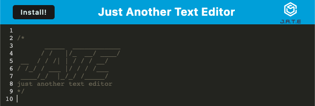

# PWA Text editor
A text editor that runs in the browser. The app will be a single-page application that meets the PWA criteria. Additionally, it will feature a number of data persistence techniques that serve as redundancies in case one of the options is not supported by the browser. The application will also function offline.

### User Story
```
I WANT to create notes or code snippets with or without an internet connection
SO THAT I can reliably retrieve them for later use
```

### Heroku Deployment
[Link of deployment](https://pwaalldaytexteditor.herokuapp.com/)

### Technology:
- Javascript
- Node.js
- Express.js
- Concurrently
- Webpack
- IndexedDB
- Workbox

### Screenshot


## Contact or questions
Boyd Roberts

[Coleyrockin Github](https://github.com/coleyrockin)

[Coleyrockin@aol.com](mailto:coleyrockin@aol.com)