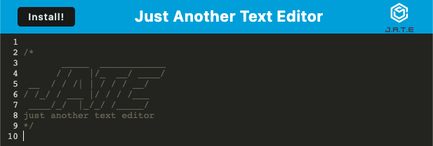

# JATE — Just Another Text Editor


## About

A progressive web application text editor that runs in the browser. Built with Webpack and service workers, it meets full PWA criteria including offline functionality, IndexedDB data persistence, and installability. Create notes or code snippets with or without an internet connection and reliably retrieve them later.

## Features

- Browser-based text editor with syntax highlighting
- Full PWA — installable to desktop or mobile home screen
- Offline functionality via service worker and Workbox
- IndexedDB for persistent client-side data storage
- Multiple data persistence layers as redundancy
- Webpack bundling with workbox plugins
- Express.js server for production builds

## Tech Stack

| Layer | Technology |
|-------|------------|
| Frontend | JavaScript (ES6), IndexedDB, Workbox |
| Bundler | Webpack 5 |
| Server | Node.js, Express.js 4 |
| PWA | Service Worker, Web App Manifest, Cache API |
| Dev Tools | Concurrently 5, Nodemon 2 |

## Getting Started

```bash
# Clone the repository
git clone https://github.com/coleyrockin/Progressive-Web-Applications.git
cd Progressive-Web-Applications

# Install dependencies
npm install

# Build the client
npm run build

# Start the application
npm start
```

The app runs at `http://localhost:3000` by default.

## Project Structure

```
Progressive-Web-Applications/
├── assets/
│   └── images/
├── client/
├── public/
├── server/
├── server.js
└── package.json
```

---

> Built by [coleyrockin](https://github.com/coleyrockin)# PWA Text editor
A text editor that runs in the browser. The app will be a single-page application that meets the PWA criteria. Additionally, it will feature a number of data persistence techniques that serve as redundancies in case one of the options is not supported by the browser. The application will also function offline.

### User Story
```
I WANT to create notes or code snippets with or without an internet connection
SO THAT I can reliably retrieve them for later use
```

### Deployment
Public hosting is currently paused (the previous Heroku dyno was decommissioned). You can run the app locally with:
1. `npm install`
2. `npm run build`
3. `npm start`

To redeploy elsewhere, use any Node-friendly host (Render, Railway, Fly.io, etc.) that runs `npm run build` before starting `node server/server.js`.

### Technology:
- Javascript
- Node.js
- Express.js
- Concurrently
- Webpack
- IndexedDB
- Workbox

### Screenshot


## Contact or questions
Boyd Roberts

[Coleyrockin Github](https://github.com/coleyrockin)

[Coleyrockin@aol.com](mailto:coleyrockin@aol.com)
