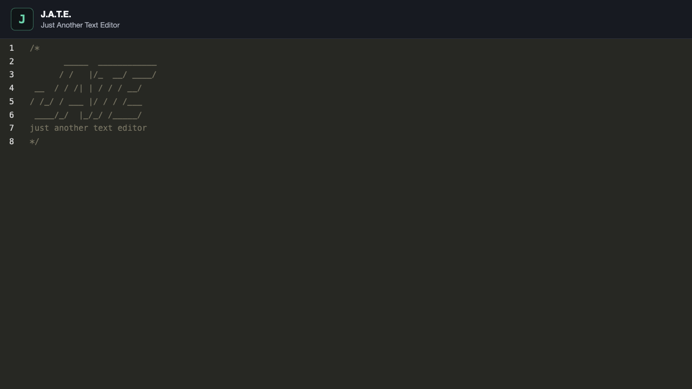
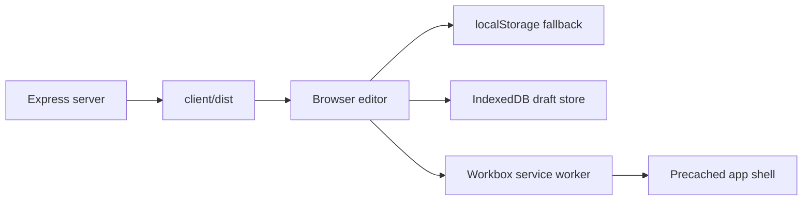

# JATE — Offline-First PWA Text Editor


JATE is an installable Progressive Web App for writing notes and JavaScript snippets in the browser. It bundles the editor locally, precaches the app shell with Workbox, and persists drafts through IndexedDB with a `localStorage` fallback.



## Highlights

- **Offline-first editor**: CodeMirror is bundled into the Webpack build, so the editor is not dependent on a CDN.
- **Installable PWA**: Web app manifest, generated icons, install prompt handling, and service-worker precaching.
- **Resilient persistence**: IndexedDB stores the canonical draft, while `localStorage` keeps a fast fallback copy.
- **Production server**: Express serves the built client with `helmet()` security headers and graceful shutdown handling.
- **Portfolio-ready UX**: polished app shell, responsive layout, accessible controls, and clear loading/error states.

## Tech Stack

| Layer | Tools |
| --- | --- |
| Front end | JavaScript, CodeMirror 5, CSS |
| Build | Webpack 5, Babel, HtmlWebpackPlugin |
| PWA | Workbox, Service Worker, Web App Manifest |
| Storage | IndexedDB via `idb`, `localStorage` fallback |
| Server | Node.js, Express, Helmet |

## Architecture


```mermaid
flowchart LR
  Browser["Browser editor"] --> LocalStorage["localStorage fallback"]
  Browser --> IndexedDB["IndexedDB draft store"]
  Browser --> ServiceWorker["Workbox service worker"]
  ServiceWorker --> Cache["Precached app shell"]
  Express["Express server"] --> Dist["client/dist"]
  Dist --> Browser
```

## Getting Started

Use Node.js 20 or newer.

```bash
npm install
npm run build
npm start
```

The app runs at [http://localhost:3000](http://localhost:3000) by default.

For development:

```bash
npm run dev
```

## Environment

Copy the sample environment file if you want to override defaults:

```bash
cp .env.example .env
```

| Variable | Purpose | Default |
| --- | --- | --- |
| `PORT` | Express server port | `3000` |
| `NODE_ENV` | Runtime environment label | unset |

## Verification Checklist

- Production build completes with `npm run build`.
- App loads without console errors.
- Editor accepts typing and keeps syntax highlighting.
- Content persists after reload.
- Service worker registers in supported browsers.
- Install prompt appears on install-capable browsers.

## Project Structure

```text
Progressive-Web-Applications/
├── assets/images/        # README screenshot
├── client/               # Webpack PWA client
│   ├── dist/             # Production build output
│   ├── src/css/          # App shell styles
│   ├── src/js/           # Editor, storage, install, and SW registration logic
│   ├── src/images/       # PWA source icon
│   ├── index.html        # HTML template
│   └── webpack.config.js
├── server/               # Express static server
├── .env.example
├── .nvmrc
└── package.json
```

## Security And Privacy

- Editor content stays local to the browser.
- No accounts, API keys, or external data writes are used.
- `.env` files are ignored; `.env.example` documents safe defaults.
- Express disables `X-Powered-By` and applies Helmet security headers with a focused CSP.

## Roadmap

- Add Playwright smoke tests for persistence, offline reloads, and install behavior.
- Add Lighthouse CI for PWA and accessibility checks.
- Modernize older starter dependencies to reduce audit noise.
- Add a hosted demo link.

## Author

Built by [Boyd Roberts](https://github.com/coleyrockin).

## License

ISC — see [LICENSE](./LICENSE).
